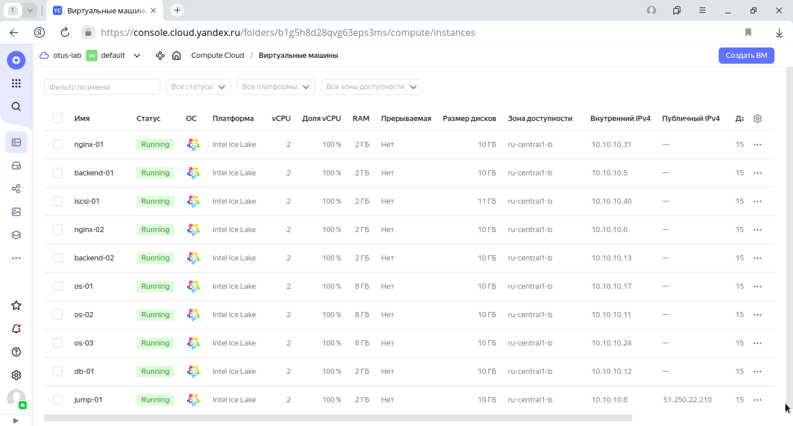

# lab-07
otus | elasticsearch (opensearch) cluster

### Домашнее задание
Настроить централизорованный сбор логов в кластер elasticsearch

#### Цель:
1. Развернуть кластер elasticsearch (минимум 3 вм)
2. Настроить сбор логов со всех серверов проекта (веб-сервера, балансеры, базы данных)


### Выполнение домашнего задания

#### Создание стенда

Стенд будем разворачивать с помощью Terraform на YandexCloud, настройку серверов будем выполнять с помощью Ansible.

Необходимые файлы размещены в репозитории GitHub по ссылке:
```
https://github.com/SergSha/lab-07.git
```

Схема:


Для начала получаем OAUTH токен:
```
https://cloud.yandex.ru/docs/iam/concepts/authorization/oauth-token
```

Настраиваем аутентификации в консоли:
```
export YC_TOKEN=$(yc iam create-token)
export TF_VAR_yc_token=$YC_TOKEN
```

Скачиваем проект с гитхаба:
```
git clone https://github.com/SergSha/lab-07.git && cd ./lab-07
```

В файле provider.tf нужно вставить свой 'cloud_id':
```
cloud_id  = "..."
```

При необходимости в файле main.tf вставить нужные 'ssh_public_key' и 'ssh_private_key', так как по умолчанию соответсвенно id_rsa.pub и id_rsa:
```
ssh_public_key  = "~/.ssh/id_rsa.pub"
ssh_private_key = "~/.ssh/id_rsa"
```

Для того чтобы развернуть стенд, нужно выполнить следующую команду:
```
terraform init && terraform apply -auto-approve && \
sleep 60 && ansible-playbook ./provision.yml
```

По завершению команды получим данные outputs:
```
Outputs:

backend-servers-info = {
  "backend-01" = {
    "ip_address" = tolist([
      "10.10.10.5",
    ])
    "nat_ip_address" = tolist([
      "",
    ])
  }
  "backend-02" = {
    "ip_address" = tolist([
      "10.10.10.13",
    ])
    "nat_ip_address" = tolist([
      "",
    ])
  }
}
db-servers-info = {
  "db-01" = {
    "ip_address" = tolist([
      "10.10.10.12",
    ])
    "nat_ip_address" = tolist([
      "",
    ])
  }
}
iscsi-servers-info = {
  "iscsi-01" = {
    "ip_address" = tolist([
      "10.10.10.40",
    ])
    "nat_ip_address" = tolist([
      "",
    ])
  }
}
jump-servers-info = {
  "jump-01" = {
    "ip_address" = tolist([
      "10.10.10.8",
    ])
    "nat_ip_address" = tolist([
      "51.250.22.210",
    ])
  }
}
nginx-servers-info = {
  "nginx-01" = {
    "ip_address" = tolist([
      "10.10.10.31",
    ])
    "nat_ip_address" = tolist([
      "",
    ])
  }
  "nginx-02" = {
    "ip_address" = tolist([
      "10.10.10.6",
    ])
    "nat_ip_address" = tolist([
      "",
    ])
  }
}
os-servers-info = {
  "os-01" = {
    "ip_address" = tolist([
      "10.10.10.17",
    ])
    "nat_ip_address" = tolist([
      "",
    ])
  }
  "os-02" = {
    "ip_address" = tolist([
      "10.10.10.11",
    ])
    "nat_ip_address" = tolist([
      "",
    ])
  }
  "os-03" = {
    "ip_address" = tolist([
      "10.10.10.24",
    ])
    "nat_ip_address" = tolist([
      "",
    ])
  }
}
```

На всех серверах будут установлены ОС Almalinux 8, настроены смнхронизация времени Chrony, система принудительного контроля доступа SELinux, в качестве firewall будет использоваться NFTables.

Стенд был взят из лабораторной работы 4 https://github.com/SergSha/lab-04. Для создания OpenSearch кластера к этому стенду добавляем кластер, состоящий из серверов os-01, os-02 и os-03. На сервер Jump-01, так он имеет публичный IP адрес, будем устанавливать OpenSearch Dashboard.

Так как на YandexCloud ограничено количество выделяемых публичных IP адресов, в дополнение к этому стенду создадим ещё один сервер jump-01 в качестве JumpHost, через который будем подключаться по SSH (в частности для Ansible) к другим серверам той же подсети.

Список виртуальных машин после запуска стенда:



Для проверки работы стенда воспользуемся отображением простой страницы собственноручно созданного сайта на PHP, 
имитирующий продажу новых и подержанных автомобилей:


Значение IP адреса сайта получен от балансировщика от YandexCloud:


Страница OpenSearch Dashboard открывается в браузере, вводя в адресную строку публичный IP адрес сервера jump-01 с портом 5601:
```
51.250.22.210:5601
```


Вводим логин и пароль и кликаем по кнопке "Log In":


Стартовая страница:


Кликаем на "Главное меню", выбираем "Discover":


Кликаем по кнопке "Create index pattern":


В поле "Index pattern name" вводим "logstash-*" и кликаем по кнопке "Next step":


Из списка "Time field" выбираем "@timestamp":


Кликаем по кнопке "Create index pattern":


Снова кликаем по кнопке "Главное меню" и выбираем "Discover":


Получаем следующую картину:


Отключим одну виртуальную машину из кластера OpenSearch, например, os-01:


Обновим страницу:


Как видим, страница работает с отключенным os-01.

Отключим ещё одну виртуальную машину из кластера OpenSearch, например, os-02:


Обновим страницу:


Как видим, страница работает при включенном os-03 и отключенных os-01 и os-02.

Включим виртуальную машину os-01 и отключим os-03:


Обновим страницу:


Как видим, страница работает при включенном os-01 и отключенных os-02 и os-03.

Включим виртуальную машину os-02 и снова отключим os-01:


Снова обновим страницу:


Как видим, страница работает при включенном os-02 и отключенных os-01 и os-03.

Можно делать вывод, чтобы OpenSearch кластер корректно функционирует и продолжает собирать логи при любых вариантах отключения серверов данного кластера.


#### Удаление стенда

Удалить развернутый стенд командой:
```
terraform destroy -auto-approve
```
