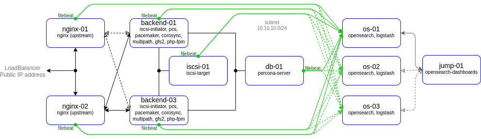

# lab-07
otus | elasticsearch (opensearch) cluster

### Домашнее задание
Настроить централизорованный сбор логов в кластер elasticsearch

#### Цель:
1. Развернуть кластер elasticsearch (минимум 3 вм)
2. Настроить сбор логов со всех серверов проекта (веб-сервера, балансеры, базы данных)


### Выполнение домашнего задания

#### Создание стенда

Стенд будем разворачивать с помощью Terraform на YandexCloud, настройку серверов будем выполнять с помощью Ansible.

Необходимые файлы размещены в репозитории GitHub по ссылке:
```
https://github.com/SergSha/lab-07.git
```

Схема:



Для начала получаем OAUTH токен:
```
https://cloud.yandex.ru/docs/iam/concepts/authorization/oauth-token
```

Настраиваем аутентификации в консоли:
```
export YC_TOKEN=$(yc iam create-token)
export TF_VAR_yc_token=$YC_TOKEN
```

Скачиваем проект с гитхаба:
```
git clone https://github.com/SergSha/lab-07.git && cd ./lab-07
```

В файле provider.tf нужно вставить свой 'cloud_id':
```
cloud_id  = "..."
```

При необходимости в файле main.tf вставить нужные 'ssh_public_key' и 'ssh_private_key', так как по умолчанию соответсвенно id_rsa.pub и id_rsa:
```
ssh_public_key  = "~/.ssh/id_rsa.pub"
ssh_private_key = "~/.ssh/id_rsa"
```

Для того чтобы развернуть стенд, нужно выполнить следующую команду:
```
terraform init && terraform apply -auto-approve && \
sleep 60 && ansible-playbook ./provision.yml
```

По завершению команды получим данные outputs:
```
Outputs:

backend-servers-info = {
  "backend-01" = {
    "ip_address" = tolist([
      "10.10.10.5",
    ])
    "nat_ip_address" = tolist([
      "",
    ])
  }
  "backend-02" = {
    "ip_address" = tolist([
      "10.10.10.31",
    ])
    "nat_ip_address" = tolist([
      "",
    ])
  }
}
db-servers-info = {
  "db-01" = {
    "ip_address" = tolist([
      "10.10.10.28",
    ])
    "nat_ip_address" = tolist([
      "",
    ])
  }
  "db-02" = {
    "ip_address" = tolist([
      "10.10.10.27",
    ])
    "nat_ip_address" = tolist([
      "",
    ])
  }
  "db-03" = {
    "ip_address" = tolist([
      "10.10.10.16",
    ])
    "nat_ip_address" = tolist([
      "",
    ])
  }
}
iscsi-servers-info = {
  "iscsi-01" = {
    "ip_address" = tolist([
      "10.10.10.7",
    ])
    "nat_ip_address" = tolist([
      "",
    ])
  }
}
jump-servers-info = {
  "jump-01" = {
    "ip_address" = tolist([
      "10.10.10.29",
    ])
    "nat_ip_address" = tolist([
      "158.160.68.18",
    ])
  }
}
loadbalancer-info = toset([
  {
    "external_address_spec" = toset([
      {
        "address" = "158.160.69.81"
        "ip_version" = "ipv4"
      },
    ])
    "internal_address_spec" = toset([])
    "name" = "http-listener"
    "port" = 80
    "protocol" = "tcp"
    "target_port" = 80
  },
])
nginx-servers-info = {
  "nginx-01" = {
    "ip_address" = tolist([
      "10.10.10.18",
    ])
    "nat_ip_address" = tolist([
      "",
    ])
  }
  "nginx-02" = {
    "ip_address" = tolist([
      "10.10.10.25",
    ])
    "nat_ip_address" = tolist([
      "",
    ])
  }
}
```

На всех серверах будут установлены ОС Almalinux 8, настроены смнхронизация времени Chrony, система принудительного контроля доступа SELinux, в качестве firewall будет использоваться NFTables.

Стенд был взят из лабораторной работы 4 https://github.com/SergSha/lab-04. К этому стенду добавляем кластер, состоящий из серверов os-01, os-02 и os-03. Для создания OpenSearch кластера будем использовать кластер PostgreSQL с ипользованием Patroni, ETCD и HAProxy.

Так как на YandexCloud ограничено количество выделяемых публичных IP адресов, в дополнение к этому стенду создадим ещё один сервер jump-01 в качестве JumpHost, через который будем подключаться по SSH (в частности для Ansible) к другим серверам той же подсети.

Список виртуальных машин после запуска стенда:


С помощью ssh через jump-сервер jump-01 подключися к какому-либо сервера PostgreSQL кластера, например, db-02:
```
ssh -J cloud-user@158.160.68.18 cloud-user@10.10.10.27
```

Посмотрим конфиги кластера: